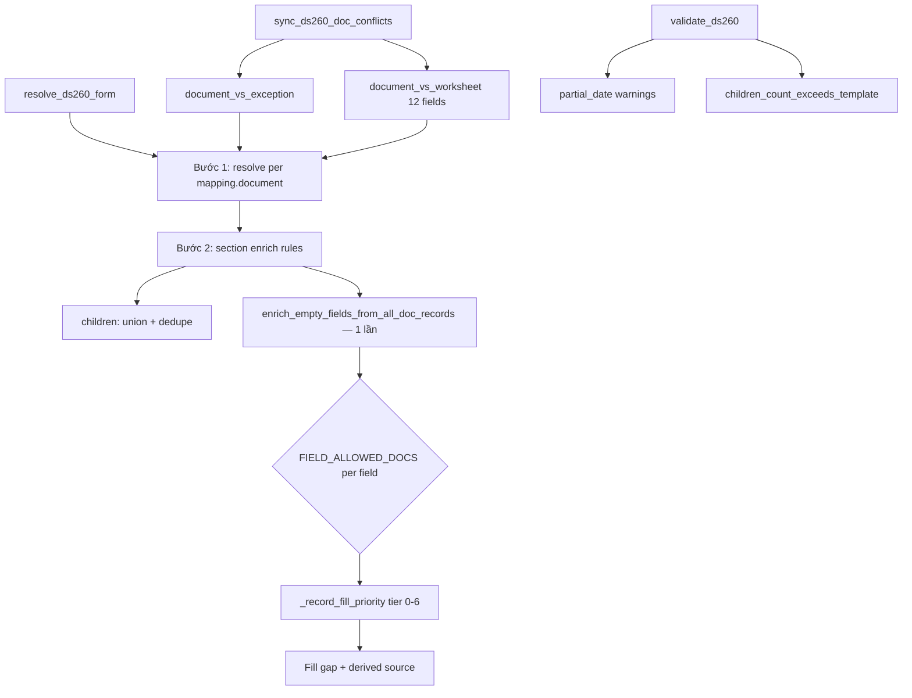

# Tài liệu kiểm tra — Hệ thống ImmiPath DS-260 (source code hiện tại)

> **Mục đích:** Gửi cho ChatGPT / reviewer bên thứ ba để đối chiếu tính đúng/sai logic nghiệp vụ và kỹ thuật.  
> **Stack:** FastAPI (Python) backend + Next.js frontend.  
> **Workspace:** `d:\app docs`  
> **Cập nhật:** 2026-06-03 — field-level `FIELD_ALLOWED_DOCS`, single enrich, worksheet conflicts (12 field), partial dates, children union/dedupe, context-gated `document_number`.

---

## 1. Mục tiêu nghiệp vụ

Hệ thống hỗ trợ luồng ImmiPath:

1. Khách upload **giấy tờ Luồng 1** (form mẫu chuẩn): Passport, Birth certificate, Judicial certificate, Marriage certificate, (+ Divorce, Death, Child birth, Military…).
2. Khách upload **bản đối chiếu `_new`** cùng loại giấy (vd. `Passport_new.pdf`).
3. Khách upload **worksheet DS-260** đã điền (`ds260.pdf` / `DS260_new.pdf`).
4. OCR → lưu từng file thành **1 dòng `ApplicantDocRecord`** theo `doc_type`.
5. **Review:** bảng Luồng 1, bảng đối chiếu, grid DS-260, panel xung đột (2 loại), validate warnings.
6. **Xuất Word** template DS-260 (`ds260_final.docx`) — điền label → value.

**Không** merge OCR vào profile applicant; mọi fill DS-260 đọc từ `ApplicantDocRecord` + `ds260_mapping.json`.

---

## 2. Luồng dữ liệu (end-to-end)

```
Upload PDF
  → classify_document()              [ocr_pipeline.py]
  → extract_document()               [OpenAI Vision hoặc mock]
  → save_extracted_fields()          [ExtractedField]
  → sync_doc_record_from_document()  [doc_record_sync.py]
       → parse_document_filename()
       → build_form_data()           [normalize_ds260_customer_raw nếu ds260_customer_form]
       → ApplicantDocRecord (raw_data + form_data)
  → finalize_applicant_after_ocr()
       → sync_ds260_doc_conflicts()  [Luồng 1 vs _new + Luồng 1 vs worksheet]

Review / Export
  → resolve_ds260_form()             [ds260_mapping.py]
  → validate_ds260()                 [ds260_validate.py]
  → fill_ds260_docx_template()       [export_ds260.py]
```

---

## 3. Phân loại giấy tờ & tên file

### 3.1. Luồng 1 — 8 loại (`DOCUMENT_REGISTRY`)

| code | Tên file gợi ý |
|------|----------------|
| passport | Passport.pdf |
| birth_certificate | Birth certificate.pdf |
| judicial_certificate | JUDICIAL CERTIFICATE.pdf |
| marriage_certificate | Marriage certificate.pdf |
| divorce | Divorce.pdf |
| death_certificate | Death certificate.pdf |
| birth_certificate_child | Birth certificate child.pdf |
| military_discharge | Military discharge.pdf |

**Variant:** `standard` = mẫu Luồng 1 · `exception` = hậu tố `_new`

### 3.2. DS-260 worksheet (`ds260_customer_form`)

- Filename: `ds260`, `ds-260`, `DS260_new`, …
- Luôn `variant = exception`
- Trong `SUPPLEMENTAL_DOCUMENT_REGISTRY` + `RECORDABLE_DOC_TYPES`

### 3.3. Bug đã sửa

Trước đây `ds260.pdf` không tạo `ApplicantDocRecord` → export trống mục 3–5.  
Hiện tại mọi file recordable đều sync (8 loại + `ds260_customer_form` + `address_document`).

---

## 4. Cấu hình mapping DS-260

**File:** `backend/data/doc_schemas/ds260_mapping.json` (~17 section, ~130 field)

```json
{
  "key": "applicant_name",
  "label": "Applicant Name",
  "document": "passport",
  "field": "full_name",
  "aliases": ["name"],
  "derive": "copy|country_from_location|city_from_place"
}
```

| Section | document chính |
|---------|----------------|
| section_a_personal, section_a_passport | passport |
| section_birth_certificate, section_father, section_mother | birth_certificate |
| section_address, section_contact, section_social | ds260_customer_form |
| section_judicial | judicial_certificate |
| section_spouse | marriage_certificate (+ birth_certificate nơi sinh spouse) |
| section_previous_spouse, section_divorce | divorce |
| section_children | birth_certificate_child |
| section_military | military_discharge |
| section_death | death_certificate |

Enrich gap-fill chỉ từ doc types trong **`FIELD_ALLOWED_DOCS`** per field (§5.4).

---

## 5. Logic điền form — `resolve_ds260_form()`

**File:** `backend/app/services/ds260_mapping.py`

### Bước 1 — Resolve theo `mapping.document`

| mapping.document | Hàm |
|----------------|-----|
| 4 loại Luồng 1 | `resolve_luong1_ds260_field()` |
| CUSTOMER_FORM types | `resolve_customer_form_field()` |
| Khác | `pick_latest_record()` + `_resolve_ds260_field_value()` |
| spouse_applicant_profile | Bỏ qua; enrich occupation riêng |

**Worksheet conflict resolution:** 12 field trong `WORKSHEET_COMPARE_KEYS` — nếu user đã chọn trên Review → ghi đè (`derived: worksheet_conflict_resolution`).

**Luồng 1 priority:** standard → exception (_new) → conflict resolution.

### Bước 2 — Section enrich (rule nghiệp vụ)

| Section | Logic |
|---------|-------|
| section_father/mother | absent N/A, `enrich_parent_is_living` |
| section_a_personal | marital từ divorce; birth city = state |
| section_spouse | marriage + birth cert + spouse applicant profile |
| section_previous_spouse | divorce decree |
| section_children | **union** birth cert + worksheet, dedupe (§5.5) |

### Bước 3 — Single enrich (production)

**Chỉ một lần** gọi `enrich_empty_fields_from_all_doc_records()` ở cuối pipeline.

```
field trống
  → lọc FIELD_ALLOWED_DOCS (field-level)
  → sort _record_fill_priority (tier 0–6)
  → _resolve_field_from_record (strict + loose)
  → gắn derived source
```

`enrich_empty_fields_from_ds260_customer_worksheet()` giữ cho test/tool — **không** gọi trong production.

**Lý do single enrich:** tránh worksheet fill rồi bị fill lại / double enrich.

### `_record_fill_priority` (tier thấp = ưu tiên cao)

| Tier | Nguồn |
|------|-------|
| 0 | Cùng doc_type + standard |
| 1 | Cùng doc_type + exception (_new) |
| 2 | Luồng 1 khác loại + exception |
| 3 | Luồng 1 khác loại + standard |
| 4 | ds260_customer_form |
| 5 | address_document, … |
| 6 | Fallback trong whitelist |

Luồng 1 official **luôn thắng** worksheet khi cùng field được phép.

### 5.4. `FIELD_ALLOWED_DOCS` — field-level

**File:** `backend/app/services/ds260_field_allowed_docs.py`

Mỗi `field_key` có allowlist riêng — **không** blanket theo section.

| field_key | allowed doc types |
|-----------|-------------------|
| `passport_number` | `passport` only |
| `nationality` | `passport`, `birth_certificate`, `ds260_customer_form` |
| `current_address` | `ds260_customer_form`, `passport`, `address_document` |
| `current_city`, `postal_code`, `primary_phone`, `email` | `ds260_customer_form` only |
| `father_surname` | `birth_certificate`, `passport`, `ds260_customer_form` |
| `father_birth_city` | `birth_certificate`, `ds260_customer_form` (không passport) |
| `judicial_certificate_number` | `judicial_certificate`, `ds260_customer_form` |

Test `test_ds260_field_allowed_docs.py`: mọi mapping field phải có entry trong `_FIELD_ALLOWED_DOCS`.

Public API: `FIELD_ALLOWED_DOCS` dict trong `ds260_mapping.py` (build từ module trên).

### 5.5. Children — union + dedupe

**Hàm:** `enrich_children_section_from_birth_certs(fields, child_recs, all_records=records)`

1. Thu thập từ mọi `birth_certificate_child`
2. Thu thập `child_1..child_N` từ `ds260_customer_form`
3. Dedupe `(tên chuẩn hóa, ngày sinh)` — ưu tiên giấy khai sinh
4. Sort theo DOB → fill tối đa **3 slot** (giới hạn mẫu Word)
5. `children_count` = max(union count, worksheet khai)

**Hạn chế:** worksheet khai 4+ con, upload 2 giấy khai sinh → union có thể >3; chỉ xuất child_1..3; warning `children_count_exceeds_template`.

Bước 1 resolve **bỏ qua** `child_N_*` keys — children chỉ qua section enrich.

---

## 6. OCR — worksheet DS-260

**Files:** `ocr_pipeline.py`, `ds260_customer_keys.py`, `document_registry.py`

- 80+ extract keys (`build_ds260_customer_extract_keys()`)
- Prompt full form: Personal, Passport, Address, Contact, Social, Family, Military
- max_pages = 12 cho `ds260_customer_form`

### Key remap — `DS260_CUSTOMER_KEY_REMAP`

An toàn: `full_name`→`applicant_name`, `passport_id`→`passport_number`, `sex`→`gender`, …

**Đã bỏ:** global `document_number` → `passport_number`

### Context-gated `document_number`

| Input | Kết quả |
|-------|---------|
| `{document_number}` alone | Không → passport |
| `{document_number, passport_type, date_of_issue}` | → passport_number |
| `{document_number, judicial_full_name}` | → judicial_certificate_number |
| `{document_number, divorce_husband_name}` | → divorce_document_number |
| `passport_document_number` | Luôn → passport_number |

Hàm: `_should_map_document_number_to_passport()`, `_allow_document_number_for_field()`, `resolve_ds260_customer_key_remap()`

### Đọc field từ record

1. `mapping.key` (DS-260 form key)
2. `mapping.field` + aliases
3. Loose match (profile keys)

Conflict compare dùng `_strict_field_value()` — không loose match.

---

## 7. Xung đột (conflicts)

**File:** `backend/app/services/ds260_conflicts.py`

### Loại 1 — `document_vs_exception`

- 4 loại Luồng 1: passport, birth_certificate, judicial_certificate, marriage_certificate
- standard vs exception cùng doc_type
- Key: `ds260.{doc_type}.{source_field}`

### Loại 2 — `document_vs_worksheet`

**12 field** (`WORKSHEET_COMPARE_KEYS`):

```
applicant_name, date_of_birth, gender, nationality, place_of_birth,
passport_number, passport_issue_date, passport_expiration_date,
current_marital_status, current_address, primary_phone, email
```

Key: `ds260.document_vs_worksheet.{mapping_key}`

**Official source overrides** (`WORKSHEET_OFFICIAL_DOC_OVERRIDES`):

| field | official doc (không phải worksheet) |
|-------|-------------------------------------|
| current_address | passport |
| primary_phone | passport |
| email | passport |

Các field còn lại: official = mapping.document (passport / divorce / …).

UI Review: **"Giấy tờ chính thức (Luồng 1)"** vs **"DS-260 khách khai"** · API: `conflict_type`, `field_label`

---

## 8. Validation & Export

### Validation — `ds260_validate.py`

| Code | Ý nghĩa |
|------|---------|
| `missing_document` | Thiếu passport |
| `missing_required_field` | Field bắt buộc trống |
| `ocr_failed` / `ocr_pending` | Trạng thái OCR |
| `passport_expired` / `passport_expiring_soon` | Hết hạn HC |
| `ds260_conflict_open` | Còn conflict chưa chọn |
| `partial_date` | Ngày thiếu ngày — vẫn export |
| `children_count_exceeds_template` | >3 con trên worksheet |
| `incomplete_section` | Section thiếu field khi đã có doc |

Partial date **không chặn** export.

### Export dates — `ds260_dates.py`

| Input | Word export |
|-------|-------------|
| `1990-01-15`, `15/01/1990` | `15 January 1990` |
| `2023-05`, `05/2023`, `May 2023` | `May 2023` |
| `2023` | `2023` |

Partial **không để trống** — kèm warning trên validate panel.

`export_ds260.py`: `_prepare_display_values()` + label regex fill (`DS260_LABEL_PATTERNS`).

---

## 9. Frontend

| Trang | Chức năng |
|-------|-----------|
| `upload/page.tsx` | Hướng dẫn Luồng 1, _new, ds260 worksheet |
| `review/page.tsx` | Tables, DS-260 grid, conflicts (2 loại), validate, export |

API: `GET /applicants/{id}/ds260-form`, `POST export-ds260`, conflicts resolve, `GET tables/reference`

---

## 10. Database entities

```
Applicant
Document            — upload, registry_doc_type, is_exception, status
ExtractedField      — OCR per document
ApplicantDocRecord  — 1 row/file: doc_type, variant, raw_data, form_data
Conflict            — ds260.* (exception + worksheet)
Export              — Word output path
```

---

## 11. Tests (pytest)

| File | Nội dung |
|------|----------|
| test_ds260_field_allowed_docs.py | Mọi field có explicit allowlist |
| test_ds260_enrich_whitelist.py | Judicial/divorce không fill passport; city/phone worksheet-only |
| test_ds260_fill_priority.py | Tier 0–6; passport_new > worksheet |
| test_ds260_conflicts.py | document_vs_exception + worksheet (12 field) |
| test_ds260_dates.py | Partial May 2023 / 2023; full 15 January 1990 |
| test_ds260_children.py | Union birth cert + worksheet, dedupe |
| test_ds260_customer_keys.py | OCR remap, context-gated document_number |
| test_ds260_address_contact.py | Passport_new chỉ fill current_address |
| test_ds260_reference_fallback.py | Luồng 1 _new fallback |
| test_ds260_customer_form.py | ds260 filename, resolve |
| test_ds260_spouse/parents/marital/previous_spouse/… | Section rules |
| test_export_ds260_context.py | Không leak applicant vào father block |

```bash
cd backend && .venv\Scripts\python.exe -m pytest tests/ -k ds260 -q
```

~79 tests (2026-06-03).

---

## 12. Hạn chế / reviewer checklist

### Nghiệp vụ

1. Ưu tiên nguồn: Luồng 1 → cross-fill (whitelist) → worksheet — khớp ImmiPath?
2. Worksheet conflict 12 field — đủ chưa?
3. Children >3: union OK nhưng template max 3 slot — quy trình nghiệp vụ?
4. Spouse occupation: cần spouse applicant trong DB.

### Kỹ thuật

1. OCR 12 trang — chi phí; mock khi hết quota.
2. `FIELD_ALLOWED_DOCS` — sửa từng field trong `ds260_field_allowed_docs.py`.
3. Partial dates — CEAC có chấp nhận `May 2023`?
4. Re-OCR sau đổi schema — file cũ không tự cập nhật.

### Field coverage

Template Word có label chưa map trong `ds260_mapping.json` (Other Name Used, spouse immigrating, …).  
Đối chiếu `_ds260_final_inspect.txt` vs mapping keys.

---

## 13. File source chính

```
backend/
  data/doc_schemas/ds260_mapping.json
  app/services/
    document_registry.py
    doc_record_sync.py
    ocr_pipeline.py
    ds260_mapping.py              # resolve, enrich, children union, priority
    ds260_field_allowed_docs.py   # FIELD_ALLOWED_DOCS per field
    ds260_customer_keys.py        # OCR keys + document_number gate
    ds260_conflicts.py            # 2 loại conflict
    ds260_validate.py
    ds260_dates.py                # full + partial format
    export_ds260.py
  tests/test_ds260*.py

frontend/src/app/applicants/[id]/
  upload/page.tsx
  review/page.tsx
```

---

## 14. Prompt gợi ý gửi ChatGPT

```
Bạn là reviewer kỹ thuật + nghiệp vụ định cư Mỹ (DS-260 ImmiPath).

Đọc DS260_IMPLEMENTATION_REVIEW.md và trả lời:

1. Luồng ưu tiên (Luồng 1 → cross-fill whitelist → worksheet) có đúng spec không?
2. FIELD_ALLOWED_DOCS field-level + context-gated document_number — còn leak không?
3. Worksheet conflict 12 field — đủ chưa?
4. Single enrich (một lần cuối) — còn rủi ro double fill không?
5. Partial dates (May 2023 / 2023 + warning) — hợp lý cho DS-260 VN/CEAC?
6. Children union + dedupe — xử lý 4 con / 2 giấy khai sinh đủ chưa?
7. Field template Word THIẾU trong ds260_mapping.json.
8. Đề xuất sửa: critical / should / nice.
```

---

## 15. Timeline thay đổi

| # | Thay đổi |
|---|----------|
| 1 | `ds260_customer_form` + sync doc record (fix mục 3–5 trống) |
| 2 | Mapping mục 3–5 → ds260_customer_form |
| 3 | `_record_fill_priority`: Luồng 1 thắng worksheet (tier 0–6) |
| 4 | Worksheet conflicts: 12 field + UI Review |
| 5 | `FIELD_ALLOWED_DOCS` field-level (`ds260_field_allowed_docs.py`) |
| 6 | Context-gated `document_number` remap |
| 7 | Single enrich: `enrich_empty_fields_from_all_doc_records()` một lần |
| 8 | Partial dates: `May 2023` / `2023` + warning (không blank) |
| 9 | Children: union birth cert + worksheet, dedupe, max 3 slot |

---

## 16. Sơ đồ fill



---

*Tài liệu review — phản ánh source 2026-06-03. Không thay thế spec nghiệp vụ ImmiPath chính thức.*
